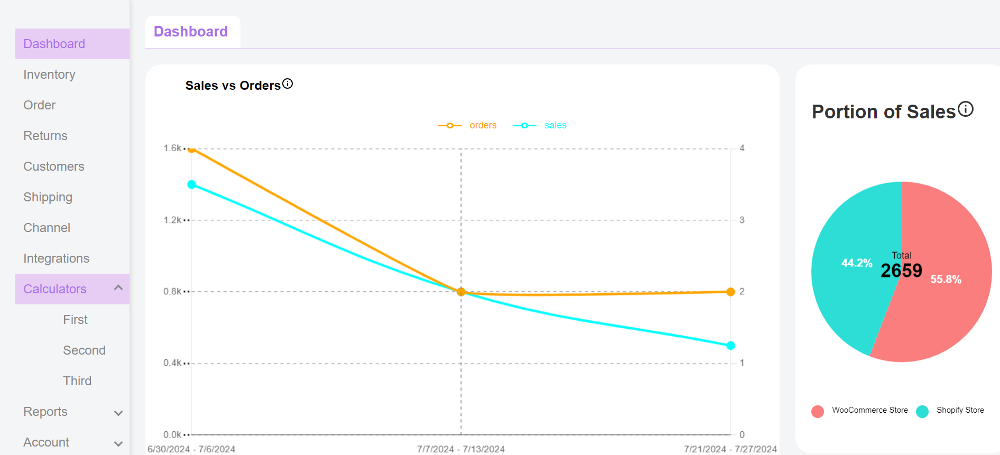

# AdaptNXT


# Dashboard Application


## Overview

This project is a React-based dashboard application that features a sidebar navigation, line and pie charts for data visualization, and conditional rendering of content based on the selected navigation item.

### Key Features:
- **Sidebar Navigation**: Allows users to switch between different sections of the dashboard.
- **Conditional Rendering**: Displays the main content with charts when the "Dashboard" item is selected, and a heading with the selected item name for other sections.
- **Line and Pie Charts**: Visualizes sales and orders data using `Chart.js`.

## Project Structure

```bash
├── src
│   ├── Components
│   │   ├── Dashboard
│   │   │   ├── Dashboard.jsx
│   │   │   └── Dashboard.css
│   │   ├── LineChart
│   │   │   ├── LineChart.jsx
│   │   │   └── LineChart.css
│   │   ├── PieChart
│   │   │   ├── PieChart.jsx
│   │   │   └── PieChart.css
│   │   └── Sidebar
│   │       ├── Sidebar.jsx
│   │       └── Sidebar.css
│   ├── App.jsx
│   └── App.css
└── README.md
```

### Components

1. **App Component (`App.jsx`)**:
   - The root component of the application that renders the `Dashboard` component.

2. **Dashboard Component (`Dashboard.jsx`)**:
   - Manages the layout and content of the main dashboard.
   - Uses `useState` to track the currently selected item from the sidebar.
   - Conditionally renders content based on the selected item:
     - Displays `LineChart` and `PieChart` components when "Dashboard" is selected.
     - Displays an `h1` tag with the name of the selected item for other options.

3. **Sidebar Component (`Sidebar.jsx`)**:
   - Provides a list of navigation items (e.g., Dashboard, Inventory, Orders, etc.).
   - Highlights the currently selected item and triggers a callback to update the selected item in the parent `Dashboard` component.

4. **LineChart Component (`LineChart.jsx`)**:
   - Implements a line chart using `Chart.js` to visualize orders and sales data.
   - Customizes the chart appearance with grid lines, tooltips, and legends.

5. **PieChart Component (`PieChart.jsx`)**:
   - Implements a pie chart using `Chart.js` to visualize the sales distribution between different stores.
   - Adds custom text in the center of the chart and displays percentages on the pie segments.

### Styling

Each component has a corresponding CSS file to manage its styles:

- **App.css**: Styles the overall layout and appearance of the application.
- **Dashboard.css**: Handles the layout of the dashboard and main content area.
- **Sidebar.css**: Styles the sidebar, including active and hover states.
- **LineChart.css**: Customizes the appearance of the line chart and its legend.
- **PieChart.css**: Customizes the appearance of the pie chart and its legend.

## Getting Started

### Prerequisites

- Ensure you have Node.js and npm installed on your system.

### Installation

1. Clone the repository:
   ```bash
   git clone https://github.com/your-repo/dashboard-app.git
   ```
2. Navigate to the project directory:
   ```bash
   cd dashboard-app
   ```
3. Install the dependencies:
   ```bash
   npm install
   ```

### Running the Application

To start the application, use the following command:

```bash
npm start
```

This will run the app in development mode. Open [http://localhost:3000](http://localhost:3000) to view it in the browser.

### Usage

1. **Navigation**: Use the sidebar to switch between different sections. The "Dashboard" section will display charts, while other sections will display the selected item name.
2. **Data Visualization**: The "Dashboard" section includes a line chart and a pie chart to visualize sales and orders data.

### Customization

- **Adding New Sections**: To add a new section to the sidebar, simply include the item in the `Sidebar` component's list and handle the rendering logic in the `Dashboard` component.
- **Modifying Charts**: The data and options for the charts can be customized in their respective component files (`LineChart.jsx` and `PieChart.jsx`).
